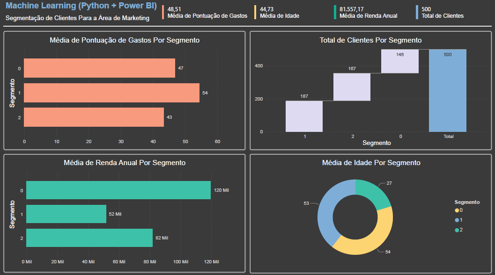

# Segmentação de Clientes com Machine Learning

## Descrição

Este projeto utiliza dados fictícios de clientes, disponibilizados pela Data Science Academy. O objetivo é realizar uma segmentação de mercado com base em idade, renda anual e pontuação de gastos, agrupando os clientes em 3 segmentos distintos e, posteriormente, gerar um relatório visual no Power BI, permitindo que a área de Marketing personalize campanhas e estratégias.

## Definição do Problema
A empresa deseja identificar grupos de clientes com características semelhantes para direcionar campanhas de Marketing.  
O desafio é aplicar Machine Learning (utilizando K-Means) para criar os clusters e disponibilizar um relatório com:

- Média de idade por segmento
- Média de renda anual por segmento
- Média de pontuação de gastos por segmento
- Total de clientes em cada segmento

## Dados
- **dados_clientes.csv**: dataset fictício com idade, renda anual e pontuação de gastos.  
- **segmentos.csv**: resultado da segmentação, incluindo o cluster atribuído a cada cliente.  

## Passo a Passo

### 1. Carregamento dos Dados

```python
# Versão da Linguagem Python

from platform import python_version
print('Versão da Linguagem Python Usada Neste Jupyter Notebook:', python_version())
```
```python
# Importa os pacotes
import pandas as pd
from sklearn.cluster import KMeans
from sklearn.preprocessing import StandardScaler
```
```python
# Carrega os dados
df_dsa = pd.read_csv('dados/dados_clientes.csv')
```
```python
# Verifica o tipo do objeto
type(df_dsa)
```

```python
# Visualiza as 10 primeiras linhas
df_dsa.head(10)
```

### 2. Análise Exploratória dos Dados

```python
# Resumo estatístico das variáveis para verificar consistência e distribuição dos dados
df_dsa[['idade', 'renda_anual', 'pontuacao_gastos']].describe()
```

### 3. Pré-Processamento

```python
# Cria o padronizador dos dados
padronizador = StandardScaler()
```

```python
# Aplica o padronizador somente nas variáveis de interesse
dados_padronizados = padronizador.fit_transform(df_dsa[['idade', 'renda_anual', 'pontuacao_gastos']])
```

```python
# Visualiza os dados
print(dados_padronizados)
```

### 4. Modelo (K-Means)

```python
# Definição do número de clusters (k).
k = 3
```
```python
# Cria o modelo K-means
kmeans = KMeans(n_clusters = k)
```
```python
# Treina o modelo com os dados padronizados
kmeans.fit(dados_padronizados)
```
```python
# Atribui os rótulos dos clusters aos clientes
df_dsa['cluster'] = kmeans.labels_
```
```python
# Exibe o resultado (10 primeiras linhas)
df_dsa.head(10)
```
```python
# Salva o resultado em disco
df_dsa.to_csv('dados/segmentos.csv', index = False)
```
### 5. Relatório no Power BI

O resultado da segmentação foi importado para o Power BI Desktop e visualizado em dashboards, incluindo:

- Média de idade por segmento
- Média de renda anual por segmento
- Média de pontuação de gastos por segmento
- Distribuição de clientes por cluster



### Ferramentas Utilizadas
- Python (Pandas, Scikit-learn)
- Jupyter Notebook
- Power BI Desktop


